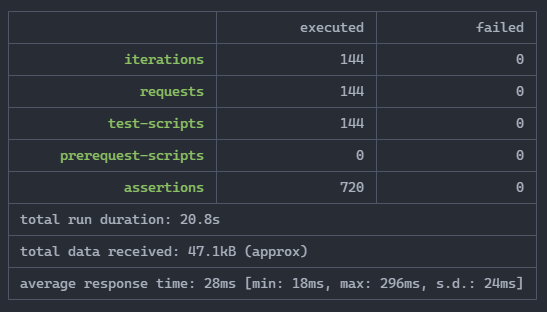

# SROC Rules Service Batch Tests

This project contains the acceptance tests in the form of batch tests for the Rules Service built using Postman which can be run using [Newman](https://learning.postman.com/docs/running-collections/using-newman-cli/command-line-integration-with-newman/). 

## Pre-Requisites 

You will need [Node.js](https://nodejs.org/en/) installed (ideally an LTS version)

You'll also need [Newman](https://learning.postman.com/docs/running-collections/using-newman-cli/command-line-integration-with-newman/) installed 

## Installation

All you need to do is clone the repository and drop into it

```bash
git clone https://github.com/DEFRA/sroc-rules-service-tests.git && cd sroc-rules-service-tests
```

## Configuration

> Important! Do not add environment files to source control

We have 2 environments where the Rules Service Tests could be running; **non-prod** and **prod**.

For each environment you wish to test you'll need to create an [environment file](https://learning.postman.com/docs/sending-requests/managing-environments/) in  `environments/`. An [example](/environments/example.postman_environment.json) with dummy data is provided as a reference.

For example, if you wanted to start testing the **non-prod** environment the steps would be

- duplicate [example.json](/environments/example.json)
- rename to something meaningful; `nonprod.json`
- update the `name` attribute to something meaningful: `"name": "Rules Service Non-Prod tests",`
- update the `value` attribute for each of the properties (`baseUrl`, `userName` & `password`) to match the environment

You'll need to contact an existing [team member](https://github.com/DEFRA/sroc-service-team) to obtain the proper credentials.

Git is setup to ignore everything bar the example environment file. Even so, double check your environment file has not been comitted before pushing it to GitHub.

## Test Structure

In order to adequately test the rules service, we opted for a data driven approach and made use of Postman's test runner and its ability to upload sets of data which allows us to test multiple permutations as individual requests. This is what we call a "batch" test. These batch tests are made up of 2 parts;

- _**An excel file**_ (found under Batch Work Sheets) that calculates expected charge values for any combination of rules service input data for a specific financial year 
- _**A corresponding Postman collection**_ which runs a csv version of the `Inputs` tab in the aforementioned excel file against the rules service financial year set and asserts whether the calculated expected responses match the actual responses returned. This can be used for any given regime and financial year so long as the rules set exists.

Both the Postman collections and the Batch files point to specific Rules Service financial year sets. The correct combination of Batch File and Postman collection must be used or the tests will fail. In some cases the Rules set won't have changed from one financial year to the next and so there is no need to change the Batch file calculation data and we can use the same file to individually test against multiple financial years. E.g If I wanted to test the Waste rules set for Financial Year 2018-2019, I would select the Postman collection for 18-19 and the pre 19-20 Batch file. If I wanted to test the following financial year, I would choose the post 19-20 Batch file. 

### Batch File Structure
Columns B to O in the `Inputs` tab are the data item inputs in each iterative request to the Rules set. This test covers both business logic scenarios and multiple permutations of inputs to the Rules service. 

Columns P to Z define the expected responses from the Rules service, with the charge value itself shown in column P. The expected responses are calculated for all charge types in the `Calcs` tab. The `Calcs` tab references the `Chg_Factors` (or `BaselineChargeLookup` for all other regimes outside Water Resources) and `Reduction_Values` tabs in deriving the expected responses. These factors and reduction values must of course be in-line with those used in the rules service for the financial year being tested.

## Future Financial years

In order to test a new financial year rules set in the projects current form, you would first have to get a update the relevant master batch work sheet and produce a `.csv` file that is readable to the project runner. 

The worksheet is designed to be able to accept new data for a change in the rules. Any changes to the values in the Charge Factors or Baseline Charges tabs (depending on the regime) effects the calculated expected values in the Input tab. Please see instructions below to update files;

### Installations, Waste & Water Quality

To update a worksheet for the Installations, Waste or Water Quality regimes;

- Open the relevant master batch work sheet located in the`/Batch Work Sheets` folder. 
- Overwrite the `BaselineChargeLookup` values with the new set and save as a new file. Make sure its named appropriately.
- Save the `Inputs` tab as a new `.csv` file. This is your new batch file ready for test.

### Water Resources

To update a worksheet for the Water Resources regime;

- Open the latest master batch work sheet located in the`/Batch Work Sheets` folder. 
- Overwrite the `Chg_Factors` & `Reduction_Values` with the new set and save as a new file. Make sure its named appropriately.
- Save the `Inputs` tab as a new `.csv` file. This is your new batch file ready for test.

> If the Ruleset is the same as the previous year then the previous batch can be used. Just make sure it now references this by naming it pre or post(FY). 

### Collection File

Once you have created new batch files based on the new financial years ruleset, you will now have to create a new Postman collection file which includes the updated endpoint for the rules set being tested. This endpoint appends the base URL with the regime and financial year identifiers E.g. `{{baseUrl}}/WRLS_Pre_SRoC_RuleApp/1.0/WRLS_Pre_SRoC_RuleSet_2022_23`. The collection also contains the actual tests that the runner will execute. You can copy and edit an existing collection file in Postman by importing or edit the raw file instead.

## Execution

To run the tests you will need to call a collection along with the corresponding batch csv file and an environment in CLI. 

For example to run the Installations 20-21 Financial Year Ruleset batch test in the non-prod environment you would need to call the following: 

```bash
newman run installations/Installations_20-21.json -d installations/Batch_Post_19-20.csv -e environments/nonprod.json
```



See [commands.json](/commands.json) for a list of commands for each regime. This is particularly handy to run multiple or all rules sets consecutively. 

## How to contribute to this project

If you have an idea you'd like to contribute please log an issue.

All contributions should be submitted via a pull request.